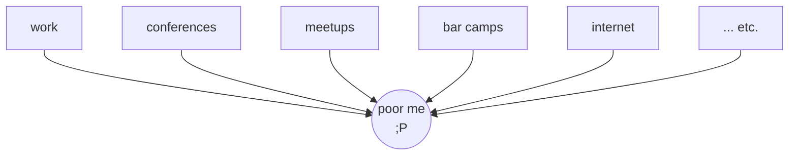

# Issue

So many sources of information & ideas to follow up with ...

```mermaid {scale: 1.2}
flowchart TD
    work --> me((poor me\n;P))
    conferences --> me
    meetups --> me
    bc[bar camps] --> me
    internet --> me
    etc[... etc.] --> me
```

