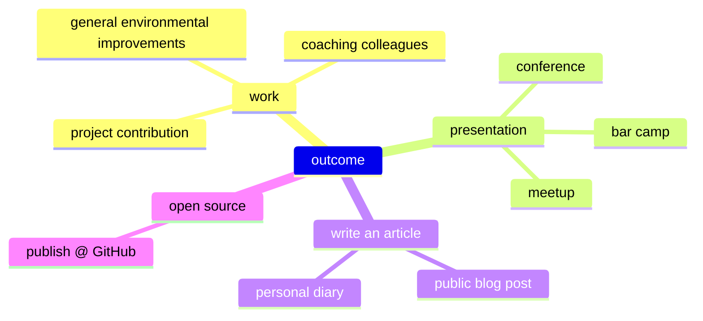

# Outcome

So many possibilities to transfer your learning achievements into some ___visible___ outcome!

By choosing __at least one__ option to make it visible (to others), you increase your own engagement!
