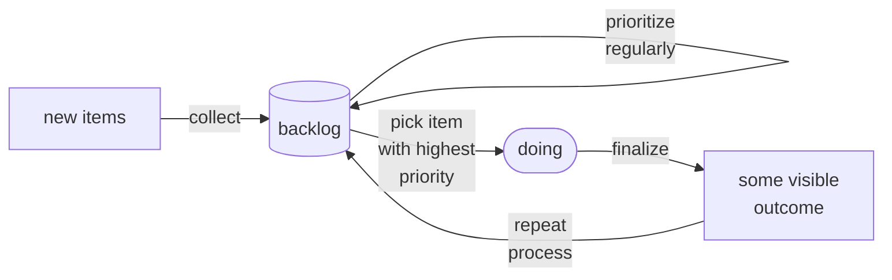

# Process

Plan of action - to face the wild horde of impressions to chase after ;-P

```mermaid {scale: 1.3}
flowchart LR
    new[new items] -- collect --> b[(backlog)]
    -- prioritize\nregularly --> b -- pick item\nwith highest\npriority -->
    w([doing]) -- finalize --> out[some visible\noutcome] -- repeat\nprocess --> b
```

... ok, to be honest, it reminds me a bit of scrum ...
