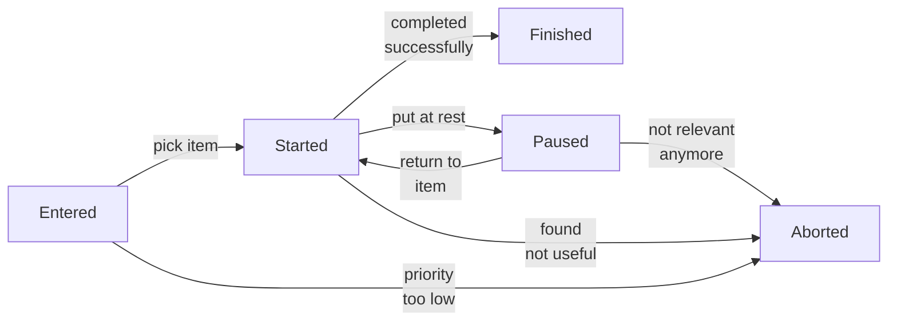

# States

```mermaid {scale: 1.2}
flowchart LR
    Entered -- pick item --> Started
    Started -- completed\nsuccessfully --> Finished
    
    Started -- put at rest --> Paused
    Paused -- return to\nitem --> Started
    Paused -- not relevant\nanymore --> Aborted

    Started -- found\nnot useful --> Aborted
    Entered -- priority\ntoo low --> Aborted
```

... please feel free to define your own state flow ...
