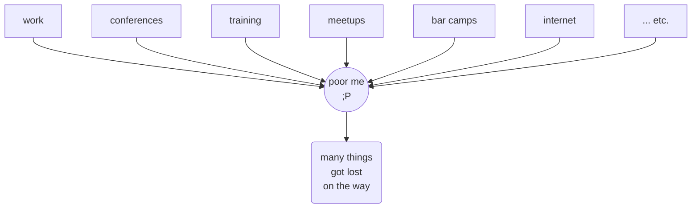
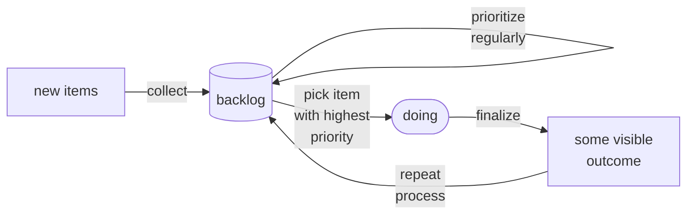
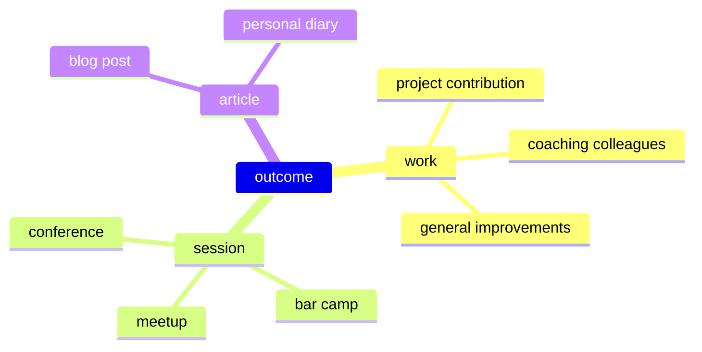
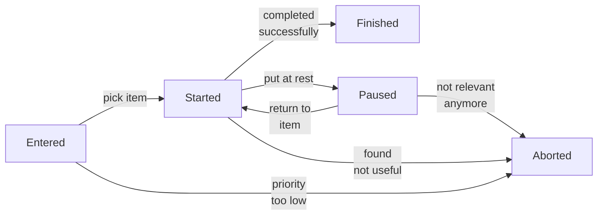

# A Learning Log Process

How to handle so many interesting topics coming in

  
    Press Space for next page <carbon:arrow-right class="inline"/>
  

    v2023-11-15
    <a href="https://github.com/sourcefranke/learning-logs-presentation" target="_blank" alt="GitHub"
        class="text-xl slidev-icon-btn !border-none !hover:text-white">
        <carbon-logo-github />
    </a>

---

# Issue

So many sources of information & ideas to follow up with ...

---

# Process

Plan of action for facing the wild horde of impressions to chase after & to follow up with ;-P

---

# Backlog

It all started with an Excel sheet ...

| **Topic**       | **Source**     | **Input Date** | **Priority** | **Connection**         | **Outcome**               | **Status** | **Comments**                            |
|-----------------|----------------|----------------|--------------|------------------------|---------------------------|------------|-----------------------------------------|
| Learning Logs   | personal need  | 2023/8/15      | 1            | Personal Need          | DigiCamp Session          | Started    | Develop some process you can talk about |
| Slidev          | Community Talk | 2022/9/23      | 1            | Tool for presentations | Talk about some topic     | Finished   | Prepare and publish slides for session  |
| Spock Framework | Meetup         | 2021/8/12      | 4            | Work project           | Direct use for daily work | Entered    | Write Unit tests more efficiently       |

---

# Personal Connection

    

---

# Outcome

So many possibilities to transfer your learning achievements into some <u>___visible___</u> outcome!

---

# Status

---
layout: image-right
image: explosion.png
class: justify-center
---

# But ... how about time?

---
layout: end
---

# Let's discuss!
